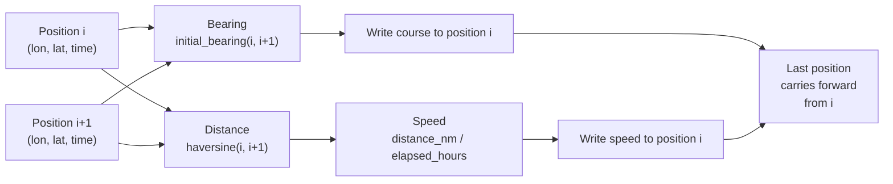

## What We Built

Raw track positions tell you where a vessel was. They do not tell you where it was heading or how fast it was moving. The generate-courses-speeds tool derives those values -- course (bearing in degrees, 0-360) and speed (knots) -- from consecutive track positions using Haversine distance and great-circle bearing formulas.

This is the first tool in the `track/manipulation` category. It takes a track with bare timestamped positions and enriches every position with computed navigational metadata. Those values then feed into downstream analysis: dead reckoning, pattern detection, tactical assessment. Without them, most of those workflows cannot start.

The tool ships in three forms: a language-neutral specification at `shared/tools/track/manipulation/generate-courses-speeds.1.0.md`, a Python implementation using the `@tool` decorator in `debrief-calc`, and a TypeScript mirror for the VS Code extension fallback. 16 files changed, 993 insertions, 10 new tests, 352 total tests passing.

## How It Works

The algorithm walks consecutive position pairs. For each pair, it computes the initial bearing (forward azimuth) and the Haversine distance, then divides distance by elapsed time for speed.



A key design choice: course is **forward-looking**. Position i gets the bearing from i to i+1. The last position has no "next", so it carries forward the penultimate leg's values. This gives N values for N positions -- no gaps, no nulls.

Coordinates come from `geometry.coordinates[i]`, not from position metadata. This follows the parallel-array convention established in feature #048: geometry owns the spatial data, positions own the temporal and derived data.

```
FOR EACH consecutive pair (i, i+1):
    bearing  = initial_bearing(coords[i], coords[i+1])
    dist_nm  = haversine(coords[i], coords[i+1])
    speed    = dist_nm / elapsed_hours

    positions[i].course = round(bearing, 2)
    positions[i].speed  = round(speed, 2)

positions[N-1].course = positions[N-2].course
positions[N-1].speed  = positions[N-2].speed
```

Values are rounded to 2 decimal places. Override mode: existing course and speed values are always replaced with freshly computed values.

## Edge Cases

Real-world track data is messy. Five edge cases handled:

| Scenario | Course | Speed |
|----------|--------|-------|
| Single-position track | Unchanged (no values written) | Unchanged |
| Stationary vessel (identical coords) | 0 degrees | 0 knots |
| Zero time interval (identical timestamps) | Computed from geometry | 0 knots |
| Non-TRACK features in collection | Silently skipped | Silently skipped |
| Antimeridian crossing | Handled by atan2 | Handled by Haversine |

The single-position case is worth noting: the tool returns the track completely unchanged. There is no meaningful course or speed to derive from one fix, so the tool does not fabricate values.

## Lessons Learned

This tool is categorised as "low complexity" and it lived up to that. The math is well-understood -- Haversine and initial bearing are textbook formulas. The interesting decisions were not about algorithms but about conventions.

Forward-looking vs. backward-looking course was the biggest one. Forward-looking ("where am I heading from here?") matches how navigators think and how legacy Debrief presented the data. It also means the awkwardness lands on the last position rather than the first, and "carry forward" is more intuitive than "carry backward" for that final fix.

The spec-first workflow from #049 and #050 continues to compress implementation time. With golden I/O fixtures defining the contract, both Python and TypeScript implementations converged quickly. The 10 new tests are mostly verifying that the implementations match the golden examples, plus edge-case coverage.

## What's Next

With course and speed now derivable from any track, the path opens to tools that consume those values: dead reckoning projections, speed-change detection, and the course-rate calculations that support manoeuvre analysis. This tool is a building block -- it turns raw positional data into the navigational vocabulary that the rest of the analysis toolkit expects.

> [See the spec](https://github.com/debrief/debrief-future/tree/main/shared/tools/track/manipulation/generate-courses-speeds.1.0.md)
