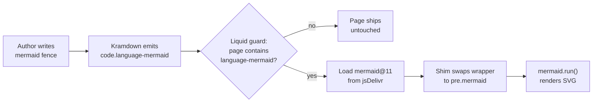

## What We Built

Future Debrief blog posts have been authoring Mermaid diagrams in
fenced ` ```mermaid ` code blocks since the Generate Courses and
Speeds Tool post in February. GitHub previews of the source markdown
rendered them properly; the published site at `debrief.github.io`
shipped them to readers as raw text. A screenshot on 2026-04-26
confirmed it: the `sequenceDiagram` in our log-panel-E2E post was a
wall of `participant` and `->>` lines on a white background.

That stops now. The `future-post` layout renders `mermaid` fences
client-side, so authors keep writing standard fences and readers see
real diagrams. Three already-published posts (specs 061, 210, plus
217's evidence pages) start rendering correctly the moment the layout
change ships — no backfill needed.

## How It Works

The fix is a single Liquid-gated `<script type="module">` block of
about a dozen lines, appended to `_layouts/future-post.html`:



A ``
guard means non-diagram posts (the majority) load zero extra bytes.
Diagram-bearing pages import `mermaid@11` from jsDelivr, walk every
`code.language-mermaid` element, replace the kramdown wrapper with a
fresh `<pre class="mermaid">`, and call `mermaid.run()`. The
`/publish-future-post` pipeline is unchanged — authors continue to
write standard fences inside the spec's `media/shipped-post.md`.

If the flowchart above renders as a diagram, the wiring is working.
If you see raw `flowchart LR` source, jsDelivr is unreachable from
your network — the failure mode is a graceful degrade to the
pre-existing raw-text fallback.

## Key Decisions

- **Client-side over pre-rendered.** Pre-rendering to SVG inside the
  publish step would have meant a Node + Puppeteer dependency in the
  pipeline and a backfill of three already-published posts. Worth
  revisiting only if diagrams later need to appear in non-HTML
  contexts (RSS, PDF). Client-side is the smaller, faster change.
- **CDN over vendored asset.** Vendoring `mermaid.min.js` would cost
  ~600 KB of git history per upgrade for no reader benefit. The
  public marketing site is an explicitly online-only surface — the
  project's offline-by-default principle applies to core platform
  functionality (services, schemas, file IO), not the website.
- **Standard fences over a custom Liquid tag.** A
  `…` tag would
  have broken GitHub's native preview of the source post and forced
  the technical-specialist agent to learn a new syntax. The whole
  point of Mermaid is that fenced blocks render everywhere they're
  seen.

## What's Next

The technical-media authoring guideline now states that Mermaid
renders both in GitHub previews and on the published site, removing
the previous implicit "GitHub-preview-only" framing. Diagrams stop
being a nice-on-GitHub extra and become a first-class part of how we
explain shipped work.

→ [See the spec](https://github.com/debrief/debrief-future/tree/main/specs/999-mermaid-blog-rendering/spec.md)
