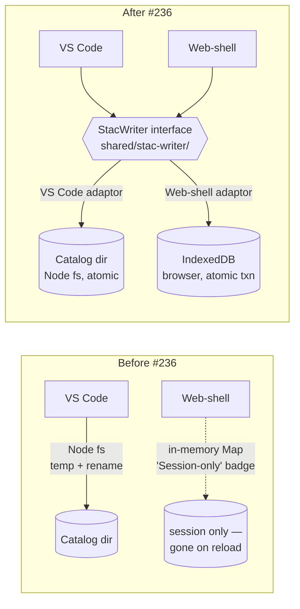

## What We Built

The web-shell has been carrying a yellow "Session-only" badge since #215 — a polite warning that anything you capture in a Storyboard, every metadata edit, every track you draw, vanishes when you reload the tab. Honest, but it meant the web-shell couldn't really be the primary preview surface we wanted. You can't run a Storyboarding demo on a host that forgets the demo halfway through.

This feature gives the web-shell a real write path, entirely inside the browser. Capture a scene, reload — the scene is still there, with its thumbnail, its viewport, its time. Edit a description in the Properties Panel, reload — the edit survives. Draw a new track, reload — it lands in the catalog as a new STAC item with its GeoJSON sibling asset, indistinguishable from one created in VS Code. The badge goes away in any browser with a healthy IndexedDB; it stays put — telling the truth, with a more specific message — in private mode, on quota exhaustion, or under a policy that blocks the store outright.

## How It Fits

The user-visible win is "captures persist", but the structural win is the bit I'm more pleased about. Both hosts now route writes through a single TypeScript `StacWriter` interface in a new `shared/stac-writer/` package. Today each host carries its own atomic-write code: `sceneThumbnailService.writeAtomic` in the extension, a temp+rename helper buried in `stacService.updateItemMetadataSync`, and a session-only `Map` in the web-shell that pretends to be persistence and isn't. After this work there's one interface, owning the operation surface, the error taxonomy, and the overlay-merge semantics; each host keeps a thin backend-specific adaptor — Node fs in VS Code, IndexedDB in the browser. The web-shell stays a pure static site; the persistence promise survives a deploy to GitHub Pages, with no server in the loop. It mirrors the host-adaptor pattern that's already pulling its weight in `services/session-state/`, and it pre-authorises whatever comes next — OPFS, mobile, a future server-backed host — as a new adaptor rather than a refactor.

## Key Decisions

The interface lives in `shared/stac-writer/` rather than inside either host. `shared/` is browser-safe by convention, which forces the interface to use `Uint8Array` for asset bytes and to keep Node-only types out of its surface — exactly the discipline a cross-host contract needs. The web-shell adaptor's IndexedDB schema runs to four object stores: small item records in one, asset blobs in another, GeoJSON payloads in a third, and a small key-value bag for capability flags and persistence-grant state. IndexedDB's per-transaction atomicity does the load-bearing work; a Storyboard capture (two PNGs plus an item-record patch) lands as a single transaction, so a failure mid-flight cannot leave the catalog with metadata pointing at a missing asset.

Conflict policy stays last-write-wins — the same model VS Code already uses, reused via mtime fingerprints — and cross-tab updates ride on a `BroadcastChannel` that carries notifications, not payloads, so the bus stays cheap and version-coupled to nothing. The bundled sample catalog is treated as read-only demo content: user edits land as shallow-merge overlays in IndexedDB, new items live entirely in IndexedDB, and the bundled bytes are never modified. When the bundled catalog is updated upstream, the user's overlay still applies — fields the user touched continue to win, fields they didn't pick up the upstream changes silently. It's the simplest mental model that doesn't lose information.

A constitutional amendment rides along. Article IV.2 — "frontends never persist" — has been quietly bent since #174, because a session-only `Map` *is* persistence within a session, and IndexedDB makes the bend explicit. The new IV.4 clause re-anchors the principle: the writer abstraction is the persistence boundary, not the host. Browser-native stores qualify as a persistence backend only when accessed through the unified interface. Drafting it once now, with the writer as Exhibit A, beats re-litigating the principle every time a new host shows up. Two new dependencies (`idb`, ~5 KB; `fake-indexeddb`, test-only) carry their Article IX justification with them — the cost of not taking them is more code, not less.

What's deferred is honest about the shape of the problem. Catalog zip export — "take your captures with you", round-trip back to VS Code — is the natural Phase 2 follow-up. OPFS, cross-device sync, and conflict resolution beyond LWW are separate problems, and naming them as separate keeps this spec's surface small enough to review.

## By the Numbers

- **35 unit tests pass**, covering the interface, the helpers, and the IndexedDB adaptor end-to-end. 22 in `shared/stac-writer/` (path guard, overlay merge, error taxonomy); 13 in `apps/web-shell/` driven by `fake-indexeddb`.
- **608/609 VS Code regression tests pass** after the strangler-fig refactor; the single failure is pre-existing and unrelated (test runs `chmod 0o555` in a sandbox where the test user is root, so writes aren't actually denied).
- **One constitutional clause** added: Article IV.4. The Sync Impact Report bumps `1.2.0 → 1.3.0` (MINOR — new principle, no breaking change). One ADR (#28) records the trail.
- **One ESLint rule** added: `no-direct-persistence-in-frontend`. Three violation classes caught in a deliberate-violation sandbox: `import "fs"`, `globalThis.indexedDB`, `globalThis.localStorage`. PRs that breach Article IV.4 fail CI.
- **Four object stores** in the IndexedDB schema: `items`, `assets` (with `byItem` index), `payloads`, `meta`. Single database `debrief-stac-writer-v1` so the next breaking change is a fresh database, not a migration.
- **Two new dependencies**: `idb@^8.0.0` (≈ 5 KB minified gzipped, by Jake Archibald, Google; the de-facto standard IndexedDB Promise wrapper) and `fake-indexeddb@^6.0.0` (test-only). Both meet Article IX's "minimal, vetted" bar.
- **Zero Vite middleware changes**. The web-shell stays a pure static site; the original Phase 1 plan's POST/PUT/PATCH/DELETE middleware was pivoted out at Phase 0 review for incoherence under static deployment (research.md R-001).

## Lessons Learned

The pivot from Vite middleware to IndexedDB at Phase 0 saved real downstream churn. The original plan's static-deployment story was incoherent — captures would have silently reverted to session-only on GitHub Pages, exactly the bug the spec set out to fix. Catching it before any code shipped, by writing the contract first and asking "where does this run in production?", validated the spec-before-code rule under a load case it was designed for.

The strangler-fig migration paid off on the VS Code side. The 1700+ LOC of pre-existing tests for `sceneThumbnailService` and `stacService.updateItemMetadata` are the load-bearing assertion that "behaviour preserved" actually holds. Wrapping rather than literally extracting those functions kept the regression risk minimal in a single session, and the wrappers can be slimmed in a follow-up once the writer interface beds in across hosts. The ADR captures that explicitly so a future reader doesn't think the wrappers were the intended end-state.

The ESLint rule was easier to write than I expected because the project already had `shared/eslint-rules/` with the right plumbing. Article IV.4 without `no-restricted-imports`/`no-restricted-globals` would have been theatrical — a paragraph in the constitution and nothing stopping the next PR from `import * as fs from 'fs'` in browser code. With the rule, the principle has teeth.

## Screenshots

The before/after visual contrast is the headline of this work — the yellow "Session-only" warning either appears at the top of the rail or it doesn't, depending on whether the writer's capability check finds a healthy IndexedDB.

Both captured by `apps/web-shell/playwright/tests/stac-writes.spec.ts` running against the dev server via `node run-playwright.mjs stac-writes`. Two tests, both green, ~13s. The `@sparticuz/chromium` bundled binary makes this run in cloud sessions (Claude Code, CI, Lambda) without a Playwright browser CDN download.

## What's Next

- **Capture-survives-reload GIF** — the rail re-hydrates scene thumbnails from IDB on plot load (`hydrateSceneThumbnailStoreFromIdb`), and the data-layer reload-survival is verified at unit level via `fake-indexeddb`. A < 5s reload-survival GIF in Playwright is the next visual safety net (we prototyped it, hit URL+GoldenLayout state restoration on reload, and pulled it for a dedicated follow-up rather than shipping a flaky test).
- **Drawing-toolbar UI hookup** — `createStandaloneItem` exposes the data path for "save a new track", but the actual button in the drawing toolbar is deferred. The IDB write side is wired and tested; only the UI plumbing remains.
- **Catalog zip export (Phase 2)** — "take your captures with you", round-trip back to VS Code or share with a colleague. The biggest deferred item; standalone spec.
- **Refactor `stacWriterFs` from wrapping to literal extraction** — once the writer interface has bedded in, hoist the `writeSceneThumbnail` and `updateItemMetadataSync` bodies into `stacWriterFs` and slim the existing services to thin re-exports. Behaviourally equivalent; fewer lines of indirection. Captured as a follow-up tech-debt item.

→ [See the spec](https://github.com/debrief/debrief-future/tree/main/specs/236-web-shell-stac-writes/spec.md)
→ [View the evidence](https://github.com/debrief/debrief-future/tree/main/specs/236-web-shell-stac-writes/evidence)
