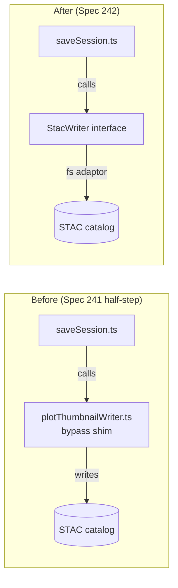
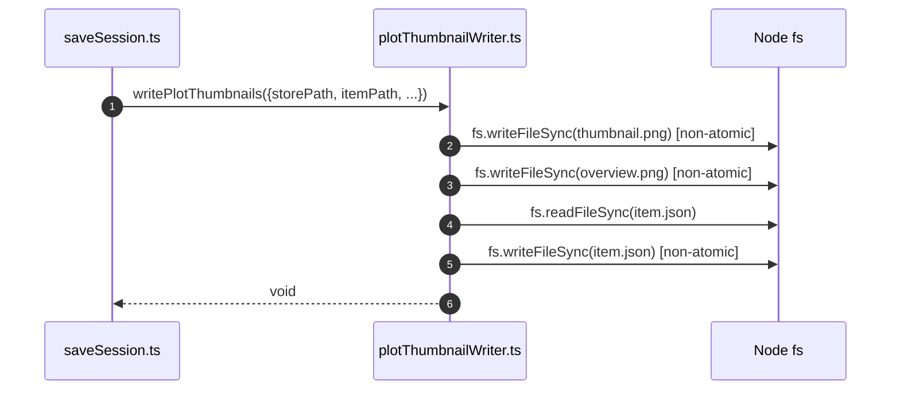
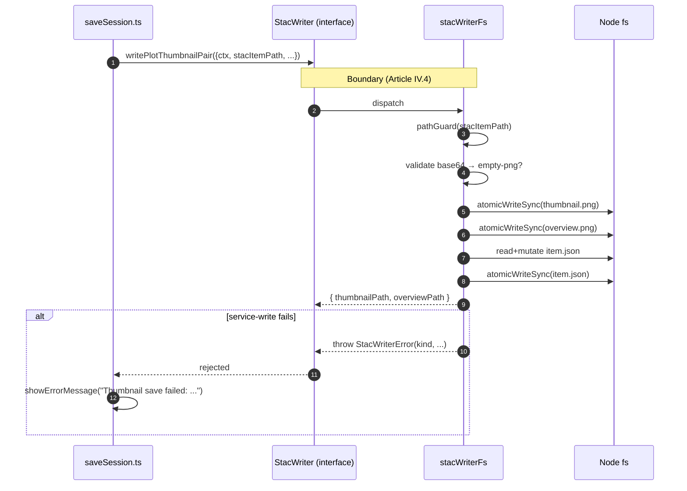

## What We Built

Spec 241 shipped STAC 1.1-compliant thumbnails but left a loose end: `plotThumbnailWriter.ts`, a shim that wrote plot thumbnail assets directly to the filesystem from inside `saveSession.ts`, bypassing the `StacWriter` unified persistence boundary. The block comment on top of the file was explicit — this was a deliberate half-step, intended to be removed in a follow-up.

This spec is the follow-up. We added `writePlotThumbnailPair()` to the `StacWriter` interface, moved the shim's logic verbatim behind it in the VS Code filesystem adaptor, and deleted the shim. The `saveSession` command now receives the writer via constructor injection and calls the interface method. Observable behaviour of "Save Session" is unchanged; the catalog shape is byte-identical.

## How It Fits

`StacWriter` is the single authorised persistence boundary for all STAC item and asset writes (Constitution Article IV.4). Every host — VS Code today, Electron and a possible web client later — implements the interface once against its native backend; nothing else in the system owns a write code path. `plotThumbnailWriter.ts` violated that rule by giving the VS Code extension a second, divergent path. Closing it means thumbnail writes now flow through the same boundary as scene thumbnail writes, STAC item updates, and every other persistence operation — one place to audit, one place to swap out when the MCP client (TODO #137) eventually arrives.

## Key Decisions

- **`writePlotThumbnailPair()` is a new method, not an overload of `writeSceneThumbnailPair()`** — scene thumbnails carry a `sceneId` and write to a keyed asset slot; plot thumbnails use fixed asset keys (`thumbnail` / `overview`) and a different asset shape. Reusing the same method would conflate two distinct contracts.

- **Web-shell adaptor throws, not no-ops** — `stacWriterIdb.ts` throws `StacWriterError('validation-failed')` because plot thumbnail captures require a Leaflet `MapPanel` that only exists in the VS Code host. A silent no-op would hide bugs; a clear error surfaces them.

- **No Python changes** — the Python MCP server already has `thumbnails.py:store_thumbnail()`, fully tested. But the VS Code extension has no MCP client yet (TODO #137), so routing through Python is out of scope. The service boundary for spec 242 is the TypeScript `StacWriter` interface, not the Python process. When #137 lands, the `stacWriterFs.ts` implementation can be replaced without touching any callers.

- **Catalog parity verified by existing tests, not new fixtures** — the implementation moves the shim's logic verbatim (same asset shape, same multihash SHA-256 checksum algorithm, same filenames). The existing `test_thumbnails.py` golden fixtures remain unchanged; passing them is sufficient evidence of parity.

- **Constructor injection, not a service locator** — `createSaveSessionCommand()` receives `stacWriter: StacWriter` alongside its existing params, following the injection pattern used throughout the extension.

## The Sequence, Before and After

The shim's sequence diagram tells the whole story. Before, four `fs.writeFileSync` calls happened inside the extension process, typed but non-atomic, with no path guard and no empty-payload check:

After, the same bytes land on disk, but they cross a typed boundary first — and pick up `pathGuard`, base64 validation, and `atomicWriteSync` for free, because the adaptor already had them:

## By the Numbers

- **10 new unit tests**: 5 in `stacWriterFs`, 4 in `saveSession`, 1 in the `stacWriterIdb` stub. All green.
- **4006 / 4006 TypeScript tests passing**, **1882 / 1882 Python tests passing**. The two pre-existing web-shell test failures (`toolResponse.test.ts`, `toolService.test.ts`) reproduce on `main` and are unrelated.
- **One source file deleted**: `plotThumbnailWriter.ts`, 124 LoC of shim, gone.
- **One method added** to `StacWriter`: `writePlotThumbnailPair`. Implementation diff: +659 / −144.
- **Persistence callsites in `apps/vscode`: 2 → 1.** The grep for direct fs writes from the extension process now returns one location: the writer adaptor.

Catalog parity was verified the cheap way: the existing `test_thumbnails.py` golden fixtures already pinned the asset shape, multihash format, `properties.updated` refresh, and legacy `thumbnail-sm` removal. Moving the logic verbatim behind the interface meant the golden fixtures kept passing without modification — which is what you want from a refactor that promises byte-identical output.

## Lessons Learned

**Half-steps work, when you label them.** Spec 241 deliberately landed a typed-but-in-process shim and tagged it as a TODO in a block comment. Spec 242 then deleted the shim and inherited zero behavioural drift, because the interim type contract was already correct. The half-step bought us a shippable thumbnail feature without forcing the writer-interface migration onto the same PR. The trick is the labelling — without the explicit "this is temporary" marker, the shim would have ossified.

**Throw, don't no-op, for unsupported host operations.** The web-shell IndexedDB adaptor could have silently returned `{ thumbnailPath: '', overviewPath: '' }` when asked to write a plot thumbnail. It doesn't. It throws `StacWriterError('validation-failed', '... not supported in the web-shell host')`. A silent stub hides misrouted calls; an explicit error makes a future bad call audit itself the moment a developer hits it in dev tools.

**Atomic writes are cheap to add at the boundary, expensive to retrofit at every callsite.** The deleted shim used plain `fs.writeFileSync` for both PNGs and `item.json` — three non-atomic writes per save, any of which could leave a torn file on disk if the extension crashed mid-save. Routing through `stacWriterFs`'s existing `atomicWriteSync` helper (temp + rename) upgraded all three writes to atomic for free. Adding atomicity to the shim directly would have duplicated the helper. Putting it at the boundary means every future writer method gets it by default.

**Closing a quiet Article I.3 violation.** The shim's call site in `saveSession.ts` caught any error from thumbnail capture and dropped it into `console.warn`. Capture timeouts deserve that treatment — they're non-blocking. Persistence failures don't: a failed write means the user's catalog is now in an unexpected state and they need to know. The new error-handling shape — `catch StacWriterError → showErrorMessage`, else `console.warn` — uses the discriminated error kind to route correctly. The user-facing improvement is small but real.

## What's Next

The interesting consequence of this refactor is what it unlocks elsewhere.

- **TODO #137 (MCP client)** becomes a single-file change. When the VS Code extension grows an MCP client, `stacWriterFs.ts` is the only replacement target — no callers to touch, no new boundary to design.
- **Spec 240 (LinkML-derived `StacItem` and `PropertiesProvenanceEntry`)** climbs in priority. The writer interface is now the authoritative contract for *every* asset write in the system, so generating its inputs from LinkML rather than hand-maintaining them removes the last hand-typed seam.
- **Specs 246/247** (web-shell hooks and lazy-loading) and other host-specific work continue to ride on this boundary. Each new host implements `StacWriter` once and is done.

The shim is gone. The boundary holds.

→ [See the spec](https://github.com/debrief/debrief-future/tree/main/specs/242-savesession-stac-writes/spec.md)
→ [View the evidence](https://github.com/debrief/debrief-future/tree/main/specs/242-savesession-stac-writes/evidence)
