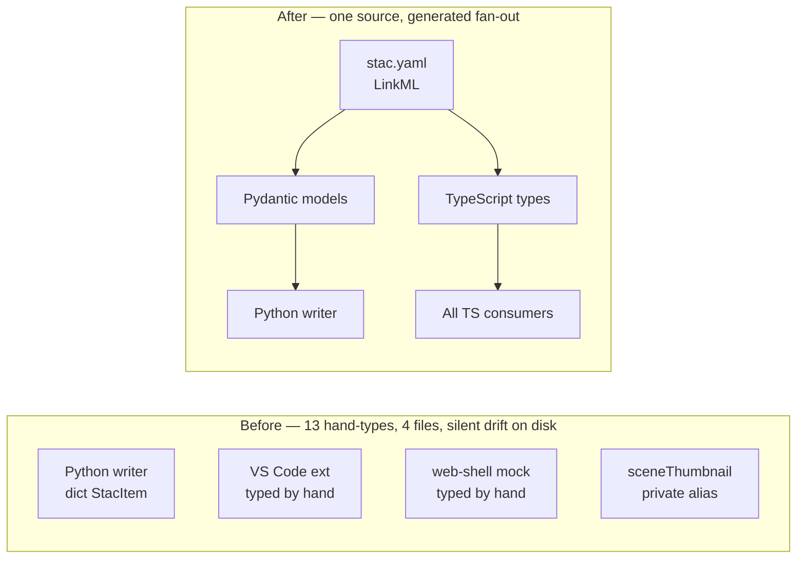

## What We Built

STAC catalog payloads — the `item.json`, `catalog.json` and `collection.json` files that record every plot in the local store — had been hand-typed on both sides of the Python ↔ TypeScript boundary since the catalog landed. Twelve interface declarations across four files, three separate copies of `StacItem`, and nothing connecting them. These files persist to disk between sessions: Python writes, TypeScript reads. A field added to one side and missed on the other didn't crash — it silently dropped on the next save.

This work promoted the cluster onto a single LinkML source. `StacItem`, `StacCatalog`, `StacCollection`, `StacLink`, `StacAsset`, `StacExtent`, `StacSummaries` and `StacProvider` now live in one file, and Pydantic models plus TypeScript types are generated from it. Every committed `item.json` under `preview/workspace/samples/local-store/` — 73 real files — loads cleanly through the generated validators on both sides. That fixture-corpus test is the strongest evidence the schema captures the wire shape that actually ships, not a sanitised cartoon of it.

## How It Fits

This is the third slice of Epic E11 — Schema-First Boundary Typing — the same programme that #222 (MCP envelopes) closed last month. Same pattern, different cluster: the audit's drift table flagged five sites in §3.1, seven more siblings were masked by the file-level R4 rule but still hand-written, and one inline alias rounded out the thirteen. All of them collapsed onto one generated class per name. The audit's `cross-domain-hand-typed` count attributed to #223 drops from 5 to 0; the `StacItem` and `StacCatalog` drift clusters in §3.2 disappear entirely.

## Key Decisions

- **STAC 1.0 and 1.1 both accepted via additive optional fields.** The local stores currently ship 1.0; spec #241 (in flight) upgrades them to 1.1. Modelling `stac_version` as a string and making the new 1.1-only fields optional means #223 and #241 can land in either order — neither blocks the other.
- **`StacCatalog` and `StacCollection` are siblings, not parent and child.** Each declares its `type` slot with `equals_string`, which generates a TypeScript literal that makes `if (x.type === 'Collection')` narrow at the call site. Inheritance was tempting — Collection is structurally Catalog-plus-extras — but it captures the relationship wrong: a Collection's `type` is `"Collection"`, not `"Catalog"`.
- **Open-record extension slots, with eyes open.** `StacItem.properties`, `StacAsset` and `StacSummaries` all carry `additional_properties: true` so the `<namespace>:<key>` convention (`debrief:platforms`, `file:checksum`, `processing:datetime`, `proj:shape`) survives the boundary. Same Article XV.2 exception #222 used for `MCPContentItem.structuredContent`, applied where STAC's own spec is genuinely open.
- **Composition over re-declaration.** `StacItemProperties` mixes in the existing `StacExtensionProperties` from `stac-extension.yaml`; `StacItem.geometry` references the seven existing geometry classes from `geojson.yaml`. No re-declared shapes anywhere — the same rule that made #222 stick.
- **Python writes through Pydantic too.** `scripts/enrich-legacy-catalog.py` switches from `dict[str, Any]` constructions to Pydantic class constructions. Field-name typos now fail at write time, not three releases later when somebody finally notices the missing key in the tree view.
- **Out of scope, and named.** The camelCase `StacItemSummary` adapter (#214 follow-up) and the STAC 1.1 wire-format work (#241) both touch adjacent files, but neither is in this feature. Calling them out keeps the diff honest and the reviewer's job small.

## By the Numbers

The audit re-run is the clearest single signal — the rows that started this feature are gone.

| | Before | After |
|---|---:|---:|
| §3.1 rows attributed to #223 | 8 | 0 |
| §3.2 `StacItem` drift cluster | 3 members | 0 |
| §3.2 `StacCatalog` drift cluster | 2 members | 0 |
| §3.2 `StacAsset` drift cluster | 2 members | 0 |
| Hand-typed declarations across the in-scope tree | 13 | 0 |

The shape of what landed:

| | |
|---|---|
| LinkML classes added to `stac.yaml` | 11 |
| LinkML enum added | 1 |
| TypeScript-only union alias | 1 (`StacCatalogOrCollection`) |
| Hand-typed declarations deleted | 13, across 4 files |
| Files touched on the consumer side | `apps/vscode/src/types/stac.ts`, `apps/vscode/src/services/sceneThumbnailService.ts`, `apps/web-shell/src/mocks/stacService.ts`, `shared/stac-writer/src/interface.ts` |
| New test cases | 128 (round-trip 36, schema comparison 16, fixture corpus 77) |
| Fixture corpus loads (no coercion) | 75 items + 2 catalogs |
| `JSON.parse(JSON.stringify(...))` projection casts removed | 1 (A-009) |

The fixture corpus is the load-bearing test. Every committed `item.json` under `preview/workspace/samples/local-store/` (73 STAC 1.1 items + 1 Collection root) and `apps/vscode/test-data/local-store/` (2 STAC 1.0 items + 1 Catalog root) loads through the generated Pydantic validators with zero coercion. Three golden fixtures — `boat1`, `analysis2-track1`, and the 81 KB preview Collection — go through Py → JSON → Py and emerge byte-equivalent.

The write side now flows through Pydantic too:

```python
from debrief_schemas import StacItem

item = {
    "type": "Feature",
    "stac_version": "1.1.0",
    "id": "core--boat1",
    "geometry": {"type": "Polygon", "coordinates": [...]},
    "bbox": [-21.866, 21.947, -21.580, 22.186],
    "properties": {
        "datetime": "1995-12-12T05:00:00+00:00",
        "title": "Saxon Warrior: Boat1",
        "debrief:platforms": [{"id": "NELSON", "name": "HMS Nelson"}],
        # extension keys: file:size, proj:shape, processing:* —
        # all accepted via the Article XV.2 open-record exception.
    },
    "links": [...],
    "assets": {...},
}

StacItem.model_validate(item)  # raises on field-name typos, missing slots
```

And the read side, on every TypeScript consumer:

```ts
import type { StacItem, StacCatalogOrCollection } from '@debrief/schemas';

const item: StacItem = JSON.parse(content);

if (root.type === 'Collection') {
  // TypeScript narrows to StacCollection — no predicate, no cast.
  // root.extent.spatial.bbox, root.license, root.summaries are typed.
}
```

The writer package re-exports `StacItem` and `StacAsset` from `@debrief/schemas` rather than declaring them locally. That closes A-009: both ends of the writer ↔ mock boundary now reference the same generated class, so the JSON projection cast that previously laundered between two structurally-equivalent-but-nominally-distinct `StacItem` types at `apps/web-shell/src/mocks/stacService.ts:464-474` is gone.

## Lessons Learned

**The STAC extension convention is genuinely open.** STAC's `<namespace>:<key>` pattern (`debrief:platforms`, `file:checksum`, `proj:shape`, `processing:datetime`) is not a closed set we could enumerate. Pydantic's `extra='allow'` and TypeScript's `[key: string]: unknown` — the Article XV.2 exception #222 introduced — are the right shape for this, not a tighter union. The plan's Complexity Tracking section spells out the trade-off: we lose compile-time knowledge of extension keys in exchange for a schema that survives contact with the on-disk corpus without coercion. Three open-record classes (`StacItemProperties`, `StacAsset`, `StacSummaries`, plus `StacItemAssetDefinition`) carry the exception. Everything else is closed.

**Nested arrays needed no new machinery.** STAC's `bbox: number[]` and `interval: (string | null)[]` slots have the same generator gotcha as GeoJSON's nested coordinate arrays — LinkML's `gen-pydantic` and `gen-typescript` emit the inner array shape incorrectly without a post-processing pass. The pass that already exists for GeoJSON handled this. No new mechanism, just a precedent applied.

**Item assets and Collection item_assets are not the same class.** STAC 1.1 makes the distinction explicit: an `Item.assets[k]` is a concrete asset with a required `href`, but a `Collection.item_assets[k]` is an *asset definition* — a template that downstream items will fill in, with no `href` of its own. The temptation was to model these as one class with `href: Optional[str]`. That would have weakened typing on the read side: consumers iterating `item.assets` would have to null-check `href` on every access despite the STAC spec guaranteeing it. Two classes — `StacAsset` (href required) and `StacItemAssetDefinition` (no href) — preserves the guarantee.

**The writer-package edit closed a fragile cast nobody had complained about.** Decision 1B brought `@debrief/stac-writer` into the migration, which initially looked like scope creep — the writer's `StacItem` was structurally compatible with the schema's. But the structural compatibility was the problem: the web-shell mock had a `JSON.parse(JSON.stringify(...))` projection at the writer-to-mock boundary specifically to launder between two nominally-distinct-but-equivalent shapes. Collapsing them onto one generated class let that cast go. Worth doing, even though no test was failing because of it.

## What's Next

E11 has three more phases queued. #224 promotes the session-state cluster — the next set of cross-boundary types where the audit still flags drift. #225 takes on the loader ↔ main IPC envelopes (smaller surface, same pattern). #226 is the residual roll-up — whatever single-domain shapes the audit still flags after #224 and #225 are merged.

Parallel to all of that, #241 (STAC 1.1 best-practices upgrade) is in flight. The local stores currently ship 1.0 in the VS Code test data and 1.1 in the preview store; #241 normalises everything to 1.1 with `file:checksum` and the rest of the 1.1 extension set. Now that the schema is rooted, #241 lands additively against generated types instead of having to coordinate with thirteen hand-typed sites.

→ [See the spec](https://github.com/debrief/debrief-future/tree/main/specs/223-linkml-stac-catalog/spec.md)
→ [View the evidence](https://github.com/debrief/debrief-future/tree/main/specs/223-linkml-stac-catalog/evidence)
