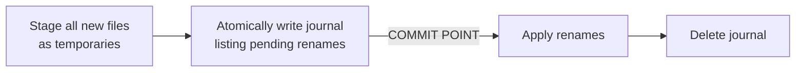

## What We Built

Saving a plot writes three things: the feature collection (`features.geojson`), the STAC metadata (`item.json`), and the thumbnail PNGs. Until now those were three independent writes done in sequence, and the "Plot saved" confirmation fired before the last of them had necessarily landed. Most of the time that is invisible. But if anything goes wrong partway through — the disk fills up, a permission is denied, the browser hits its storage quota, or the machine simply dies mid-write — you could be left with a plot that is quietly broken: new geometry against stale metadata, or a half-written file that won't open.

This spec closes that gap. A save is now atomic from the analyst's perspective (FR-001): after any save attempt, the persisted plot is observable as either the complete new state or the complete previous state, never a partial mixture. The success marker only appears once every write that makes up the save has committed (FR-005). And if a save is cut off by something we can't catch — a crash, a power loss — reopening the plot yields a single coherent version rather than a corrupt one (FR-007). We deliberately aimed for coherence, not power-loss durability of the newest in-flight save: the guarantee is that you never lose *or corrupt* what was already there, not that the very last keystroke survives the plug being pulled.

## How It Works

Atomicity is concentrated behind the persistence boundary rather than scattered across frontend code. We added two host-agnostic operations to the `StacWriter` interface (`shared/stac-writer/src/interface.ts`): `commitPlotSave`, which commits the whole save unit as one, and `reconcilePlotSave`, which runs on open before the first read to heal any interrupted save. Each host implements the pair against its native backend.

On the **VS Code filesystem** adaptor (`apps/vscode/src/services/stacWriterFs.ts`), the commit point is a write-ahead intent journal:

If we die before the journal exists, nothing has moved — `reconcilePlotSave` discards the temporaries and the previous plot is byte-identical. If we die after it exists, the journal tells reconciliation exactly which renames to roll *forward* to finish the save. The journal's presence or absence is the single bit that decides roll-forward versus roll-back, and the temp-write plus rename reuse the adaptor's existing `atomicWriteSync` helper.

On the **web-shell** adaptor (`apps/web-shell/src/services/stacWriterIdb.ts`), there is no journal to invent: the three writes collapse into a single multi-store IndexedDB transaction and lean on IndexedDB's native atomicity. The call site in `apps/web-shell/src/mocks/stacService.ts` swapped its separate `writeItem` + `writeAsset` calls for one `commitPlotSave`.

The honest-reporting half lives at the call sites. `apps/vscode/src/commands/saveSession.ts` moves its `markClean` / "Plot saved" marker to *after* the commit returns, and a failure now surfaces through `window.showWarningMessage` while preserving the dirty editor state for retry. `apps/vscode/src/commands/openPlot.ts` calls `reconcilePlotSave` before `loadPlotData`, so every open heals first and reads second.

No new runtime dependencies — just `node:fs` / `node:crypto` on the desktop and the existing `idb` library in the browser.

## Key Decisions

- **The boundary owns atomicity, not the frontend (Article IV).** The feature-collection write moved off a raw `fs.writeFileSync` onto the `@debrief/stac-writer` boundary, so neither host can regress it and the logic lives in exactly two adaptors.
- **Coherence over durability, on purpose.** Guaranteeing the newest in-flight save survives power loss would have meant `fsync` barriers and a heavier design. The narrower "never corrupt, never half-update" guarantee removed the silent-corruption risk entirely at a fraction of the cost.
- **`Pick`-derived DTOs.** The `CommitPlotSaveInput` type is derived rather than hand-listed, so a new save artifact can't be silently omitted from a commit — the omission becomes a compile error.

## By the Numbers

| Metric | Value |
|---|---|
| New tests passing | 32 (0 failures) |
| FS adaptor — commit / reconcile | 5 / 6 |
| IndexedDB adaptor | 7 |
| VS Code host call sites | 9 |
| Playwright E2E smoke | 1 |
| Compile-time type guard (`tsc --noEmit`) | 1 |
| Full suite on the same commit | 998 passing, zero new failures |

Three properties are enforced mechanically: exactly one IndexedDB transaction per save, zero success messages for an uncommitted save, and compile-time guards against omitted fields. A fault-injection matrix exercises interruption points across both backends — every one resolves to a single coherent version.

## What's Next

This makes the persistence boundary the right place to add any future durability knob, should analyst feedback ask for one — the commit point is now a single, named operation per host rather than a sequence of bare writes. For now, the half-updated plot is gone: a save either lands or it doesn't, and you always reopen something whole.

→ [See the spec](https://github.com/debrief/debrief-future/tree/main/specs/268-save-atomicity/spec.md)
→ [View the evidence](https://github.com/debrief/debrief-future/tree/main/specs/268-save-atomicity/evidence)
