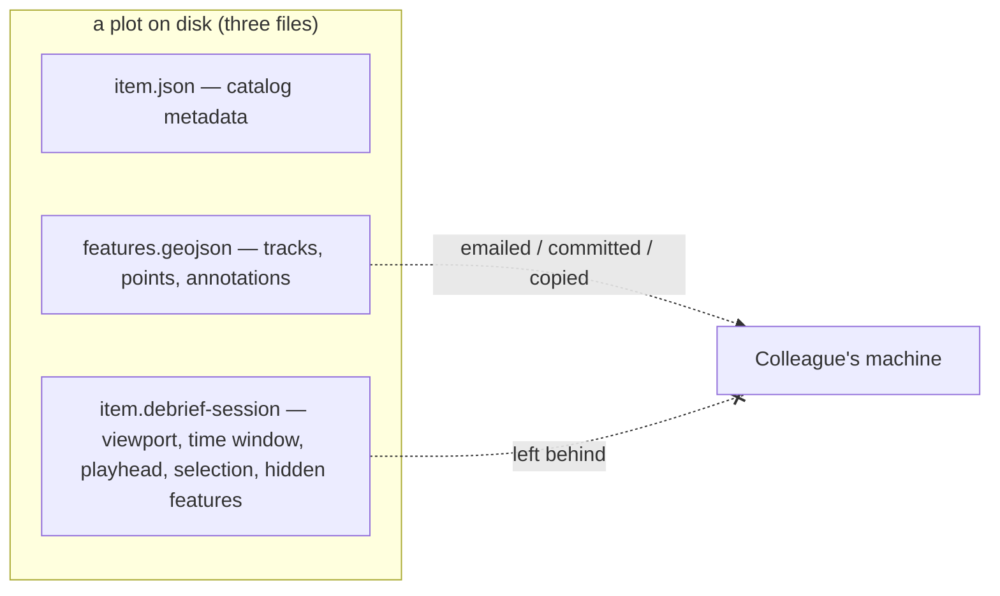
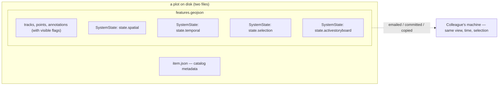

**Today** — a plot is three files on disk, and the one that holds your interactive state is the one that doesn't travel:

**After** — the sidecar is gone. A plot is two files, and the entire interactive view rebuilds from `features.geojson` alone:

## What We Built

When you save a plot today, the part of it you were actually looking at gets left behind. The map viewport, the analytical time window, the playhead position, the feature selection, which features you'd hidden — all of it lives in a sibling file, the `item.debrief-session` sidecar, that gets stripped the moment the plot leaves your machine. Email a colleague the GeoJSON, pull it from a STAC catalogue, check it out of git, copy it to a USB stick, and they open it on the default global view, a default time window, and an empty selection. The portable artefact — `features.geojson` — carries none of the state that makes the plot *yours*.

This work deletes the sidecar entirely. Every field it held is given a proper home: plot state (viewport, time window, playhead, selection, active storyboard) becomes a handful of `SystemState` Features written directly into the FeatureCollection, addressed by deterministic ids like `state.spatial` and `state.temporal`; per-feature state — visibility — becomes a `visible` flag on the individual feature it describes, so hiding a track travels with that track; and genuinely ephemeral runtime — whether you're currently playing, transient drawing mode, a viewport lock — simply isn't persisted, and defaults cleanly on load. After this, a plot is exactly two files, `item.json` and `features.geojson`, and the whole interactive state is reconstructable from the GeoJSON alone. Hand a colleague a single file and they open it exactly where you left it.

## How It Fits

This is the payoff of two principles the project has held from the start: schema-first single source of truth, and the plot file as the one portable, canonical artefact. Until now those principles were quietly contradicted by the sidecar — a second persistence path that split plot state across two files, only one of which travelled. The fix generalises a pattern that already shipped for a single case: #237 introduced the `SystemState` Feature for the active-storyboard pin, and this work makes that the general home for *all* non-spatial plot state. The same shape on disk, the same deterministic addressing, now covering spatial, temporal, and selection too. It also substantially narrows a separate planned piece of work — web-shell session persistence — because the VS Code extension and the browser web-shell now read and write the same FeatureCollection through one shared helper, rather than each carrying its own persistence path.

## Key Decisions

- **Everything that looked like "session state" is actually plot state.** The earlier assumption that playback speed, step size, the time filter, and display mode were *per-user* preferences turned out to be wrong: they describe the data being replayed, not the person replaying it, so they belong to the plot. Once that lands, the design collapses — there is no residual per-user bucket left for the sidecar to hold, which is precisely why the sidecar can be deleted outright rather than merely shrunk. No replacement store.

- **One shared read/write helper, not one per host.** Both frontends — the VS Code extension and the web-shell — go through a single helper that owns reading and writing every `SystemState` variant. #237's host-private writer is folded into it. Plot-load and plot-save become the only two places this state is touched, so the two hosts can never drift into divergent persistence behaviour.

- **Exploration never marks the plot dirty.** Panning, zooming, scrubbing the time cursor, changing the selection — none of these flag unsaved changes. Merely *looking* at a plot should never nag you to save. An explicit Save still commits the current view; only substantive content edits drive the unsaved-changes prompt. The state is captured in memory as you explore and persisted only when you choose to save.

- **Visibility lives on the feature, not in a separate list.** Hiding a track sets `visible: false` on that track and records it in the track's own provenance log. We accept that the provenance grows a little as the price of visibility travelling *with* the feature it describes — a hidden track stays hidden when the plot moves, with no separate hidden-list to keep in sync.

- **Strict on import.** A malformed or self-contradictory saved state — a playhead sitting outside its own time window, say — fails loudly with a clear error that names the offending feature. Never a silent default, never a quiet clamp. If the plot file claims something impossible, you find out immediately and you find out where.

## Screenshots

The whole round-trip in one loop — host A sets a view, only `features.geojson` is carried across, and host B rebuilds the same view (then the visibility round-trip):

The headline test is a round-trip across two hosts. Host A gets a recognisable viewport, a scoped time window, a scrubbed playhead, and a feature selection — the kind of state the sidecar used to strand on the machine that created it.

*Host A: the view we want to travel — viewport, scoped time window, playhead, and selection.*

Then we copy **only** `features.geojson` to a different machine — no STAC catalogue, no sidecar, just the one file — and open it. The whole view comes back. The title bar reads `transferred/plot.geojson`, the playhead has restored to `09:30:00`, and `track-hms-defender` is selected, all rebuilt from the GeoJSON alone.

*Host B: the same view, restored from `features.geojson` alone. No sidecar was carried across.*

Visibility travels the same way. A feature hidden on host A carries `properties.visible: false` on the feature itself, so a features-only reopen keeps it hidden — there is no separate hidden-list to lose.

*Host A: a feature hidden.*

*Host B: still hidden after a features-only reopen — the `visible` flag rode along on the feature.*

And when a saved state contradicts itself — a `current_time` outside its own `[start_time, end_time]`, or a duplicate `state_type` — load fails loudly. The error banner names the offending feature id rather than silently clamping or falling back to a default.

*Strict-on-import: a self-contradictory saved state fails loudly and names the feature at fault.*

## By the Numbers

| | |
|---|---|
| Tests passing | 2620 |
| Suites touched | 4 |
| Files per plot | 3 → 2 |
| SystemState write code paths | many → 1 shared helper |
| Shared-helper unit tests | 42 |
| `gen-json-schema` ViewportPolygon risk | non-event |

The four suites are schema adherence (Python, 1071), session-state (Vitest, 696), the VS Code extension (Vitest, 845), and the web-shell Playwright round-trip. A plot dropped from three files to two. The split persistence story — a web-shell-private `active_storyboard` writer plus a VS Code extension that wrote no SystemState at all — collapsed into one shared helper that is now the sole producer and consumer of every variant, covered by 42 focused unit tests.

The one risk we flagged in planning (FR-006a) was that `gen-json-schema` had a known bug with `Coordinate` as a multivalued class range — exactly the shape of `ViewportPolygon.coordinates` — and moving `viewport` onto `SystemStateProperties` (which *is* in the JSON Schema build) might resurface it. It didn't. The existing `generate.py` post-processor pattern already handled the case; it was a non-event.

## Lessons Learned

**A type name collision had to be paid off before anything else could move.** The schema cluster held two different things both called `Coordinate` — a scalar `type` in one file and a lng/lat `class` in another. As long as the duplicates lived in separate schemas this stayed dormant, but `SystemStateProperties` lives in `geojson.yaml`, which imports `common.yaml`, and pointing `viewport` at the canonical `ViewportPolygon` meant consolidating all the shared value types into `common.yaml` first. The moment they shared a namespace, the two `Coordinate`s collided and the consolidation had to resolve which one survived. The prerequisite refactor was larger than the feature it unblocked.

**A circular dependency decided where one variant's logic lives.** We wanted the shared helper to own all four `SystemState` variants. But `active_storyboard` originally read through `@debrief/components`, and routing the helper back through that package would have closed a dependency loop. So the helper implements the active-storyboard wire shape natively — verbatim to #237's format (NG-002), just no longer borrowed. The web-shell's *interactive* read of active-storyboard deliberately stays on the tolerant `@debrief/components` helper (R-011), because that read runs on every edit and the strict load reader throws on a duplicate or malformed feature. The shared helper owns the unified *load-time* read of all four variants and is the single writer for the three migrated ones; no host re-implements the wire shape.

**Reclassifying view-state as exploration was the real unlock.** The rule that panning, zooming, scrubbing, and selecting never mark the plot dirty (FR-019) reads like a UX nicety, but it forced a second decision that made the whole thing usable: an explicit Save now persists the current view *regardless* of the dirty flag (FR-020). VS Code's save command used to early-return "no unsaved changes" when the plot wasn't dirty — which, once view-state stopped setting the flag, would have made a looked-at-only view impossible to save at all. Relaxing that guard is what lets you open a plot, arrange the view you want, and commit it without having edited a single feature.

## What's Next

A few follow-ups are scheduled rather than done:

- **#250 — web-shell durable persistence.** This work landed the in-memory mirror (FR-009a): view-state is written into the FeatureCollection, which the web-shell already auto-persists to IndexedDB. The residual is the auto-commit-trigger UX — when to debounce a viewport nudge versus require an explicit gesture — which is a UX decision, not a persistence-mechanism gap.
- **#266 — purge stale references.** The legacy `bbox` / `center` fields are removed from the schema; lingering mentions in docs and ADRs still need a sweep.
- **#267 — out-of-window `current_time` policy.** Strict-on-import is the chosen default; whether a tolerant import path is ever warranted is parked here, to be revisited only if strict proves user-hostile.
- **#268 — broader multi-asset save atomicity.** With the sidecar gone, the dual-write failure class is gone too. The wider question — `features.geojson` versus thumbnails versus `item.json` written transactionally — is its own item.

→ [See the spec](https://github.com/debrief/debrief-future/tree/main/specs/261-session-state-systemstate/spec.md)
→ [View the evidence](https://github.com/debrief/debrief-future/tree/main/specs/261-session-state-systemstate/evidence)
